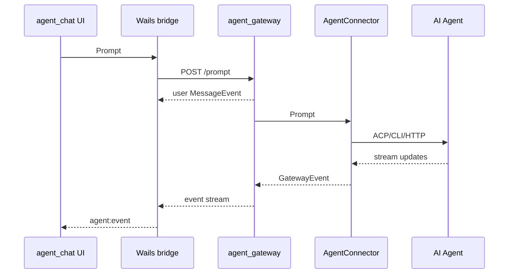

# 独立 Agent Gateway 服务设计

> 目标：把网关层从 `agent_chat` 桌面进程中拆出来，形成独立的本地服务。聊天 UI 只连接 gateway；gateway 通过 ACP、CLI、HTTP/WebSocket 等 connector 对接 `icoo-ai` 和其他 AI Agent。

## 1. 设计结论

推荐新增独立模块 `agent_gateway/`，作为本机常驻服务或由 `agent_chat` 拉起的伴随进程运行：

```text
agent_chat desktop
  -> frontend/src/services/agentBridge.js
  -> Wails bridge.AgentService
  -> Local Gateway Client
  -> http://127.0.0.1:<port> + WebSocket/SSE

agent_gateway service
  -> HTTP API: sessions, prompts, approvals, agents
  -> Event Stream: gateway events
  -> AgentConnector registry
      -> ACP stdio: agent_server/cmd/icoo-ai serve
      -> ACP stdio: other ACP-compatible agents
      -> CLI adapter: other local AI agent CLIs
      -> HTTP/WebSocket adapter: remote AI agent services
```

`agent_chat` 不再承载网关核心逻辑，只保留 UI、窗口、前端状态和一个轻量本地 gateway client。`agent_gateway` 负责会话、运行、审批、事件转换、Agent 进程生命周期、多 Agent 路由和本地持久化。

这样拆分后，后续不只有桌面聊天框能用网关，CLI、Web 管理台、IDE 插件或自动化任务也能复用同一个 gateway。代价是多一个本地服务生命周期，需要解决端口、鉴权、健康检查和版本兼容。

## 2. 模块边界

建议仓库结构：

```text
icoo_ai/
├── agent_chat/
│   ├── internal/bridge/          # Wails API，转调 gateway client
│   └── internal/gatewayclient/   # HTTP/WebSocket client
├── agent_gateway/
│   ├── cmd/agent-gateway/        # 服务入口
│   ├── internal/api/             # HTTP handlers + WebSocket/SSE
│   ├── internal/service/         # 会话、prompt、审批、路由编排
│   ├── internal/connector/       # AgentConnector 通用接口
│   ├── internal/connectors/acp/  # ACP connector
│   ├── internal/connectors/cli/  # CLI connector
│   ├── internal/connectors/remote/
│   ├── internal/store/           # 内存/jsonl/sqlite store
│   └── internal/security/        # 本地 token、origin 校验、权限边界
└── agent_server/
    └── cmd/icoo-ai serve         # 当前自研 ACP Agent
```

`agent_chat/internal/bridge` 的 DTO 可以暂时保留，避免前端大改。bridge 方法内部改为请求 `agent_gateway`：

```go
type AgentService struct {
    client *gatewayclient.Client
}
```

## 3. 独立服务职责

| 职责 | 归属 | 说明 |
|---|---|---|
| UI 展示、窗口、路由 | `agent_chat` | 只关心 DTO 和事件订阅 |
| Gateway HTTP client | `agent_chat` | 启动/发现 gateway，调用 API，转发事件到 Wails |
| 会话与运行编排 | `agent_gateway` | session、run、message、approval 的真实状态源 |
| Agent 选择与路由 | `agent_gateway` | 根据 `agentId` 选择 connector |
| ACP/CLI/Remote 适配 | `agent_gateway` | 协议差异集中在 connector |
| Agent 子进程管理 | `agent_gateway` | 启动、重启、关闭、stderr 日志 |
| 本地持久化 | `agent_gateway` | conversations、messages、runs、audit |

## 4. Gateway API

第一阶段用 HTTP JSON + WebSocket/SSE。HTTP 负责命令和查询，WebSocket/SSE 负责流式事件。

```text
GET    /health
GET    /v1/agents
POST   /v1/sessions
GET    /v1/sessions
GET    /v1/sessions/{sessionId}
GET    /v1/sessions/{sessionId}/messages
POST   /v1/sessions/{sessionId}/prompt
POST   /v1/sessions/{sessionId}/cancel
GET    /v1/runs
GET    /v1/approvals
POST   /v1/approvals/{approvalId}/decision
GET    /v1/audit
GET    /v1/events/stream      # SSE
GET    /v1/events/ws          # WebSocket，可二选一先实现
```

请求示例：

```json
{
  "title": "新的 Agent 会话",
  "cwd": "E:/code/issueye/icoo_ai",
  "agentId": "icoo-ai-acp",
  "model": "gpt-5.4"
}
```

事件统一为 envelope，便于多客户端订阅：

```json
{
  "id": "evt_20260509_0001",
  "type": "message_delta",
  "agentId": "icoo-ai-acp",
  "sessionId": "sess_001",
  "runId": "run_001",
  "payload": {},
  "createdAt": "2026-05-09T14:00:00+08:00"
}
```

## 5. Agent Connector

网关核心不依赖 ACP。ACP 只是第一种 connector。

```go
type AgentConnector interface {
    ID() string
    Profile() AgentProfile
    Capabilities(ctx context.Context) (AgentCapabilities, error)
    Start(ctx context.Context) error
    NewSession(ctx context.Context, req NewAgentSessionRequest) (AgentSession, error)
    Prompt(ctx context.Context, req AgentPromptRequest) (<-chan GatewayEvent, error)
    Cancel(ctx context.Context, sessionID string) error
    DecideApproval(ctx context.Context, req GatewayApprovalDecision) error
    Close(ctx context.Context) error
}
```

`AgentProfile` 描述可选 Agent：

```go
type AgentProfile struct {
    ID          string   `json:"id"`
    Name        string   `json:"name"`
    Protocol    string   `json:"protocol"` // acp, cli, http, websocket
    Command     string   `json:"command,omitempty"`
    Args        []string `json:"args,omitempty"`
    Endpoint    string   `json:"endpoint,omitempty"`
    Models      []string `json:"models,omitempty"`
    Description string   `json:"description,omitempty"`
}
```

默认 profile：

```toml
[gateway]
host = "127.0.0.1"
port = 0
default_agent = "icoo-ai-acp"

[[gateway.agents]]
id = "icoo-ai-acp"
name = "Icoo AI"
protocol = "acp"
command = "../agent_server/bin/icoo-ai.exe"
args = ["serve"]
```

## 6. agent_chat 对接方式

`agent_chat` 仍然保留当前 Wails 方法，前端短期不需要重写：

```go
func (s *AgentService) NewSession(ctx context.Context, req NewSessionRequest) (Conversation, error)
func (s *AgentService) Prompt(ctx context.Context, req PromptRequest) ([]MessageEvent, error)
func (s *AgentService) Cancel(ctx context.Context, sessionID string) (RunSummary, error)
func (s *AgentService) ListConversations(ctx context.Context) ([]Conversation, error)
func (s *AgentService) ListMessages(ctx context.Context, sessionID string) ([]MessageEvent, error)
func (s *AgentService) DecideApproval(ctx context.Context, req ApprovalDecisionRequest) (ApprovalDecision, error)
func (s *AgentService) ListAgentProfiles(ctx context.Context) ([]AgentProfile, error)
```

但实现变为：

```text
Wails AgentService
  -> ensureGatewayRunning()
  -> gatewayclient.Call(...)
  -> gatewayclient.SubscribeEvents(...)
  -> application.EmitEvent("agent:event", mappedMessageEvent)
```

Wails 只负责把 gateway event 转成现有 `bridge.MessageEvent` 并发给前端。后续如果前端愿意直接连 gateway WebSocket，也可以逐步绕过 Wails 事件层。

## 7. 生命周期与发现

桌面端启动时执行：

1. 检查配置文件中是否已有 gateway endpoint。
2. 调用 `/health`，可用则复用。
3. 不可用时，由 `agent_chat` 启动 `agent-gateway.exe` 伴随进程。
4. gateway 监听 `127.0.0.1` 随机端口，写入 lock/endpoint 文件。
5. `agent_chat` 读取 endpoint 和本地 token 后连接事件流。

建议 endpoint 文件：

```text
%APPDATA%/icoo-ai/gateway/endpoint.json
```

内容：

```json
{
  "pid": 12345,
  "baseUrl": "http://127.0.0.1:49152",
  "tokenFile": "E:/.../gateway/token",
  "startedAt": "2026-05-09T14:00:00+08:00"
}
```

## 8. 安全边界

独立服务必须默认只绑定 `127.0.0.1`，不监听公网地址。

第一阶段安全策略：

- 启动时生成随机本地 token。
- HTTP 请求必须带 `Authorization: Bearer <token>`。
- 校验 `Origin`，只允许 Wails/local client 或空 Origin 的本机请求。
- endpoint/token 文件权限尽量限制为当前用户。
- 默认不开放文件读写和终端 ACP client capability。
- 所有工具输出仍只保存安全摘要，不默认保存完整 raw output。

如果未来 gateway 要开放局域网或远程访问，需要单独设计用户认证、TLS、权限模型和审计，不和本地 MVP 混在一起。

## 9. 事件流与审批

Prompt 流程：



审批流程：

```text
Agent permission request
  -> connector GatewayApprovalEvent
  -> gateway pending approval store
  -> event stream pushes approval card
  -> UI calls POST /approvals/{id}/decision
  -> gateway resolves pending request
  -> connector returns selected/cancelled outcome to Agent
```

多 Agent 并发时，审批必须带 `agentId`、`sessionId`、`runId`、`connectorRequestId`，避免决策串线。

## 10. 持久化

独立 gateway 是状态源，持久化目录应从 `agent_chat` 迁出：

```text
%APPDATA%/icoo-ai/gateway/
├── config.toml
├── endpoint.json
├── token
├── conversations.json
├── messages/
│   └── <sessionId>.jsonl
├── runs.jsonl
└── audit.jsonl
```

第一阶段可用内存 store + json/jsonl 落盘。后续如果查询压力上来，再切 SQLite。DTO 与 store 接口先保持稳定：

```go
type Store interface {
    UpsertConversation(Conversation)
    AppendOrMergeMessage(MessageEvent)
    UpsertRun(RunSummary)
    UpsertApproval(ApprovalDecision)
    AppendAudit(AuditEvent)
}
```

## 11. 错误与恢复

| 场景 | gateway 行为 | agent_chat 展示 |
|---|---|---|
| gateway 未启动 | Wails 尝试拉起伴随进程 | 顶部显示“正在连接网关” |
| gateway 启动失败 | 返回明确错误和日志路径 | 显示“网关不可用” |
| gateway 版本不兼容 | `/health` 返回 version/capability | 提示升级客户端或服务 |
| Agent binary 不存在 | session/prompt 返回 `agent_binary_missing` | 会话状态 `agent_not_ready` |
| Agent 进程退出 | running run 标记 failed/cancelled | 会话状态 `disconnected` |
| ACP stdout 污染 | connector 标记 `acp_protocol_error` | 审计显示协议错误 |
| 事件流断开 | client 自动重连，按 last event id 补拉 | UI 保持已有消息 |
| 审批超时 | pending approval 过期并拒绝 | 审批卡片变 `expired` |

## 12. ADR

### ADR-001：Gateway 拆成独立本地服务

决策：从 Wails 进程内嵌网关改为独立 `agent_gateway` 服务。

理由：后续需要对接多个 AI Agent，并可能服务桌面端之外的客户端。独立服务能统一会话、审批、审计和 Agent 生命周期，避免每个客户端都实现一遍 Agent connector。

代价：部署复杂度增加，需要端口发现、鉴权、健康检查和伴随进程管理。

### ADR-002：agent_chat 只保留薄代理

决策：`agent_chat/internal/bridge` 只做 Wails binding 和 gateway client，不保存真实会话状态。

理由：前端现有 API 可以保持稳定，同时把状态源迁到 gateway。

代价：离线 mock 和真实模式需要清晰切换。开发模式可以保留 mock fallback，但生产模式应以 gateway 为准。

### ADR-003：Gateway 核心使用 Connector 模式

决策：gateway 核心不依赖 ACP 类型，所有 Agent 通过 `AgentConnector` 接入。

理由：ACP 是首个协议，不是唯一协议。Connector 能支持其他 ACP Agent、本地 CLI Agent 和远程 Agent。

代价：第一阶段会多一层事件映射。通过表驱动测试覆盖 `ACP update -> GatewayEvent -> UI DTO`。

## 13. 分阶段实现计划

### P1：独立服务骨架

- 新增 `agent_gateway/` Go module。
- 实现 `cmd/agent-gateway`、`/health`、配置加载、随机端口监听。
- 实现本地 token 和 endpoint 文件。
- `agent_chat` 增加 `gatewayclient`，能发现并调用 `/health`。

### P2：保持 UI API 不变

- `bridge.AgentService` 改为转调 gateway HTTP API。
- gateway 实现 sessions/messages/runs/approvals/audit 的 mock store。
- Wails 继续向前端发 `agent:event`。

### P3：接入 `icoo-ai` ACP connector

- gateway 实现 `connectors/acp`。
- 启动 `icoo-ai serve`，完成 initialize/newSession/prompt/cancel。
- 映射 ACP session update 到 `GatewayEvent`。

### P4：事件流与审批闭环

- 实现 SSE 或 WebSocket 事件流。
- 实现 `ApprovalBroker` 和 `/approvals/{id}/decision`。
- 修改 `agent_server` ACP server，注入 ACP-backed approver。

### P5：持久化与恢复

- conversations/messages/runs/audit 落盘。
- gateway 重启后恢复会话列表和历史消息。
- 事件流断线支持重连和补拉。

### P6：多 Agent 接入

- 实现 `GET /v1/agents`。
- 新建会话支持 `agentId`、`model`。
- 增加一个非 `icoo-ai-acp` connector spike。
- 验证两个 Agent 同时运行时，事件、审批、取消互不串线。

## 14. 验收标准

- `agent_gateway` 可独立启动并通过 `/health`。
- `agent_chat` 启动时能发现或拉起本地 gateway。
- 前端现有聊天 API 不大改，仍能创建会话、发送 prompt、接收 `agent:event`。
- gateway 能通过 ACP 连接 `icoo-ai serve`。
- 工具调用、审批、取消、运行完成能从 Agent 流转到 UI。
- 会话记录包含 `agentId`，默认 Agent 可用。
- `wails3 build DEV=true` 和 `wails3 build` 仍作为桌面端构建入口。
- gateway 有单独构建脚本，不混入前端 `npm run build` 链路。
