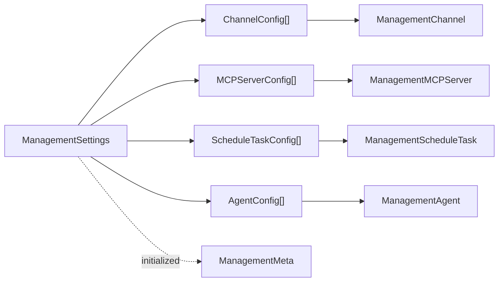
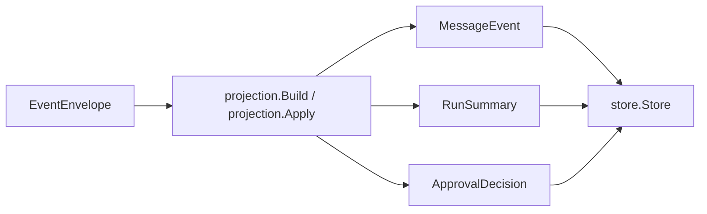
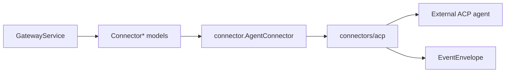
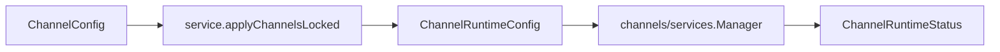
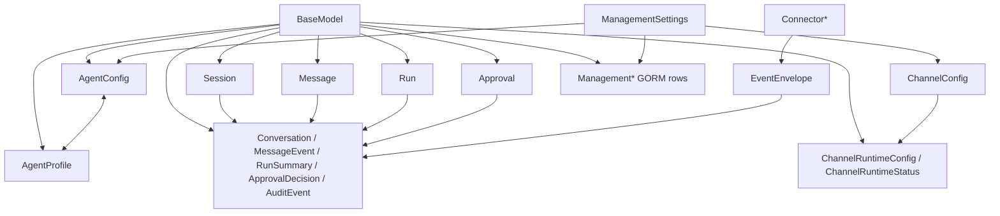

# Gateway Models Relationship

本文档整理 `agent_gateway/internal/models` 下模型的职责边界、关系和主要转换路径。

## 模型分层

### 基础模型

| 模型 | 文件 | 作用 |
| --- | --- | --- |
| `BaseModel` | `agent_gateway/internal/models/base_model.go` | 统一主键模型，提供 `ID` 字段和 GORM `BeforeCreate` 钩子。未显式设置 ID 时生成 UUID。 |
| `SafeMeta` | `agent_gateway/internal/models/safe_meta.go` | 可持久化的安全元数据 map，用于保存非敏感扩展字段。 |

`BaseModel` 被大部分具备身份标识的模型嵌入。显式业务 ID 仍可在创建前设置；如果为空，由 GORM 创建时自动生成 UUID。

## 管理配置模型

### 对外配置聚合

| 模型 | 文件 | 作用 |
| --- | --- | --- |
| `ManagementSettings` | `agent_gateway/internal/models/management_settings.go` | 管理配置的聚合 DTO，包含渠道、MCP、定时任务和 Agent 配置。 |
| `ChannelConfig` | `agent_gateway/internal/models/channel_config.go` | 管理端渠道配置。 |
| `MCPServerConfig` | `agent_gateway/internal/models/mcp_server_config.go` | 管理端 MCP 服务配置。 |
| `ScheduleTaskConfig` | `agent_gateway/internal/models/schedule_task_config.go` | 管理端定时任务配置。 |
| `AgentConfig` | `agent_gateway/internal/models/agent_config.go` | 管理端 Agent 配置，包含启用状态。 |

`ManagementSettings` 是 API 和服务层交换管理配置时使用的聚合模型，本身不直接映射数据库表；其内部切片字段标记了 `gorm:"-"`。

### GORM 持久化行模型

| 模型 | 文件 | 表名 | 作用 |
| --- | --- | --- | --- |
| `ManagementChannel` | `agent_gateway/internal/models/management_channel.go` | `management_channels` | 持久化 `ChannelConfig`。 |
| `ManagementMCPServer` | `agent_gateway/internal/models/management_mcp_server.go` | `management_mcp_servers` | 持久化 `MCPServerConfig`，参数以 JSON 字符串保存。 |
| `ManagementScheduleTask` | `agent_gateway/internal/models/management_schedule_task.go` | `management_schedule_tasks` | 持久化 `ScheduleTaskConfig`。 |
| `ManagementAgent` | `agent_gateway/internal/models/management_agent.go` | `management_agents` | 持久化 `AgentConfig`，模型列表以 JSON 字符串保存。 |
| `ManagementMeta` | `agent_gateway/internal/models/management_meta.go` | `management_meta` | 保存管理配置初始化状态等元信息。 |

`internal/service/management_settings_store.go` 负责在聚合配置模型和 GORM 行模型之间转换。

## Agent 模型

| 模型 | 文件 | 作用 |
| --- | --- | --- |
| `AgentProfile` | `agent_gateway/internal/models/agent_profile.go` | 运行时可用 Agent 档案，对外列出可选 Agent。 |
| `AgentConfig` | `agent_gateway/internal/models/agent_config.go` | 管理配置中的 Agent，带 `Enabled` 字段。 |

两者的核心关系：

- `AgentProfile -> AgentConfig`：启动时将默认运行时 Agent 档案转成管理配置种子。
- `AgentConfig -> AgentProfile`：读取管理配置后，只把启用的 Agent 转成运行时可用档案。
- `Session.AgentID`、`Run.AgentID`、`Approval.AgentID` 等字段都引用 Agent ID。

转换函数位于 `agent_gateway/internal/service/service.go`：

- `toAgentConfigs`
- `toAgentProfiles`
- `cloneAgentProfiles`

## 会话 API 模型

| 模型 | 文件 | 作用 |
| --- | --- | --- |
| `Session` | `agent_gateway/internal/models/session.go` | 对外会话模型。 |
| `CreateSessionRequest` | `agent_gateway/internal/models/session_requests.go` | 创建会话请求。 |
| `ResumeSessionRequest` | `agent_gateway/internal/models/session_requests.go` | 恢复会话请求。 |
| `SetSessionModeRequest` | `agent_gateway/internal/models/session_requests.go` | 更新会话模式请求。 |
| `SetSessionConfigOptionRequest` | `agent_gateway/internal/models/session_requests.go` | 更新会话配置项请求。 |
| `Message` | `agent_gateway/internal/models/message.go` | 对外消息模型。 |
| `PromptRequest` | `agent_gateway/internal/models/prompt.go` | 创建消息或发送 prompt 请求。 |
| `PromptResponse` | `agent_gateway/internal/models/prompt.go` | prompt 响应，聚合 run、messages 和可选 approval。 |
| `Run` | `agent_gateway/internal/models/run.go` | 对外运行记录模型。 |
| `Approval` | `agent_gateway/internal/models/approval.go` | 对外审批模型。 |
| `ApprovalDecisionRequest` | `agent_gateway/internal/models/approval.go` | 审批决策请求。 |

这些模型主要服务 HTTP API、前端和服务层业务逻辑。

## 投影持久化模型

| 模型 | 文件 | 作用 |
| --- | --- | --- |
| `Conversation` | `agent_gateway/internal/models/conversation.go` | 会话持久化视图，当前由 `store.Store` 保存。 |
| `MessageEvent` | `agent_gateway/internal/models/message_event.go` | 消息事件持久化视图。 |
| `RunSummary` | `agent_gateway/internal/models/run_summary.go` | Run 的持久化摘要视图。 |
| `ApprovalDecision` | `agent_gateway/internal/models/approval_decision.go` | 审批决策持久化视图。 |
| `AuditEvent` | `agent_gateway/internal/models/audit_event.go` | 审计事件持久化视图。 |
| `EventEnvelope` | `agent_gateway/internal/models/events.go` | 网关事件总线统一事件包。 |

`Conversation`、`MessageEvent`、`RunSummary`、`ApprovalDecision`、`AuditEvent` 是 store 层的核心数据结构。当前 store 有内存和 JSONL 实现。

`EventEnvelope` 通过投影器转换成 store 模型：

服务层还负责 API 模型和 store 模型之间的转换：

| API 模型 | Store 模型 | 转换函数 |
| --- | --- | --- |
| `Session` | `Conversation` | `toStoreConversation` / `fromStoreConversation` |
| `Message` | `MessageEvent` | `toStoreMessageEvent` / `fromStoreMessageEvent` |
| `Run` | `RunSummary` | `toStoreRun` / `fromStoreRun` |
| `Approval` | `ApprovalDecision` | `toStoreApproval` / `fromStoreApproval` |

## Connector 模型

| 模型组 | 文件 | 作用 |
| --- | --- | --- |
| `ConnectorInitialize*` | `agent_gateway/internal/models/connector.go` | 连接器初始化请求和响应。 |
| `ConnectorNewSession*` | `agent_gateway/internal/models/connector.go` | 连接器创建会话请求和响应。 |
| `ConnectorListSessions*` | `agent_gateway/internal/models/connector.go` | 连接器列出会话请求和响应。 |
| `ConnectorPrompt*` | `agent_gateway/internal/models/connector.go` | 连接器 prompt 请求和响应。 |
| `ConnectorApprovalRequest` | `agent_gateway/internal/models/connector.go` | 连接器返回的待审批请求。 |
| `ConnectorCancel*` | `agent_gateway/internal/models/connector.go` | 连接器取消 run 请求和响应。 |
| `ConnectorResumeSession*` | `agent_gateway/internal/models/connector.go` | 连接器恢复会话请求和响应。 |
| `ConnectorCloseSession*` | `agent_gateway/internal/models/connector.go` | 连接器关闭会话请求和响应。 |
| `ConnectorSetSessionMode*` | `agent_gateway/internal/models/connector.go` | 连接器设置会话模式请求和响应。 |
| `ConnectorSetSessionConfigOption*` | `agent_gateway/internal/models/connector.go` | 连接器设置会话配置项请求和响应。 |

这些模型是网关和具体 connector 实现之间的边界 DTO，由 `connector.AgentConnector` 接口使用。ACP connector 会把这些模型映射成 ACP JSON-RPC 参数和响应。

## 渠道运行时模型

| 模型 | 文件 | 作用 |
| --- | --- | --- |
| `ChannelType` | `agent_gateway/internal/models/channel.go` | 支持的渠道类型枚举。 |
| `ChannelRuntimeConfig` | `agent_gateway/internal/models/channel.go` | 渠道运行时初始化配置。 |
| `LifecycleState` | `agent_gateway/internal/models/channel.go` | 渠道生命周期状态枚举。 |
| `ChannelRuntimeStatus` | `agent_gateway/internal/models/channel.go` | 渠道运行时状态。 |

`ChannelConfig` 是管理配置模型；`ChannelRuntimeConfig` 是启动渠道服务前的运行时配置。服务层通过 `applyChannelsLocked` 完成转换。

## 总体关系图

## 当前设计边界

- `models` 包只定义数据结构、枚举和基础 GORM hook，不包含业务流程。
- `service` 包负责 API 模型、管理配置模型和持久化模型之间的转换。
- `store` 包负责 `Conversation`、`MessageEvent`、`RunSummary`、`ApprovalDecision`、`AuditEvent` 的保存和查询。
- `events` 包只保留事件总线行为，事件载荷模型已迁移到 `models.EventEnvelope`。
- `connector` 包只保留连接器行为接口和错误类型，请求/响应 DTO 已迁移到 `models.Connector*`。
